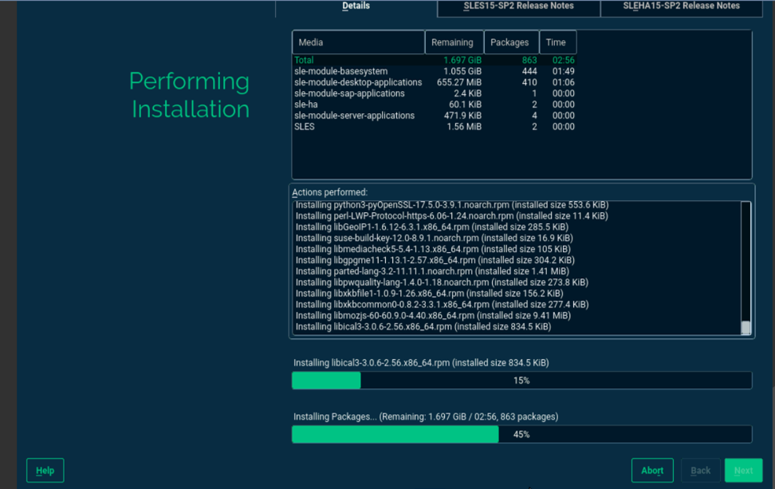
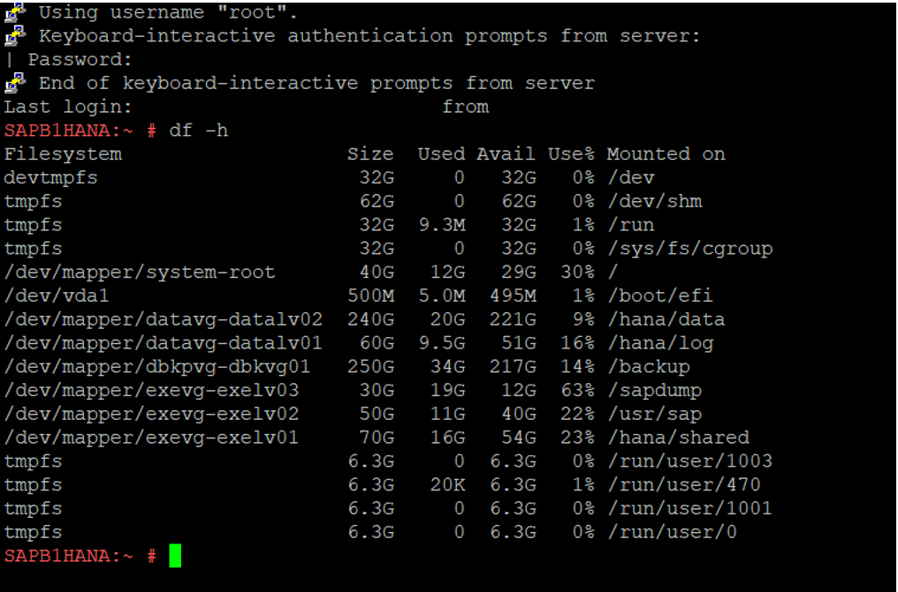

# ECS configuration
I have provisioned ECS instances by taking private images, configuring network settings, attaching storage, and optimizing performance for several projects.

🔹 **Key Achievements**

✅ Successfully deployed ECS instances on Huawei Cloud to host virtual machines for various workloads.

✅ Configured network settings like VPC, subnets, and security groups for secure communication.

✅ Integrated Elastic IPs (EIP) for public access and private IPs for internal networking.

✅ Attached cloud disks for persistent storage and optimized ECS performance based on application needs.

✅ Implemented auto-scaling based on workload demand, ensuring high availability.

✅ Applied cloud monitoring to track the health and performance of ECS instances.

