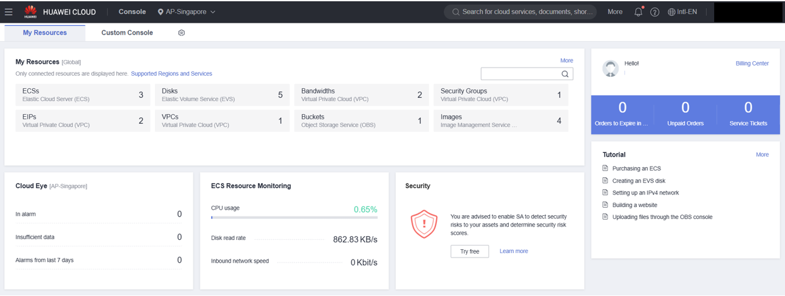

# Huawei Cloud Account Creation

I have set up accounts for over 5 customers who want to access and utilize Huawei Cloud's offerings, including compute resources, storage, networking, and more.

🔹 Key Achievements
-

✅ Successfully created a Huawei Cloud account to access the platform's full suite of services.

✅ Configured Identity and Access Management (IAM) for user roles and permissions.

✅ Set up cloud billing and subscription details to enable usage of Huawei Cloud resources.

✅ Linked the account to a specific region to enable access to Huawei Cloud services in that region.

✅ Enabled security measures like multi-factor authentication (MFA) for account protection.

✅ Used Huawei Cloud Console to manage account settings, services, and resources.

