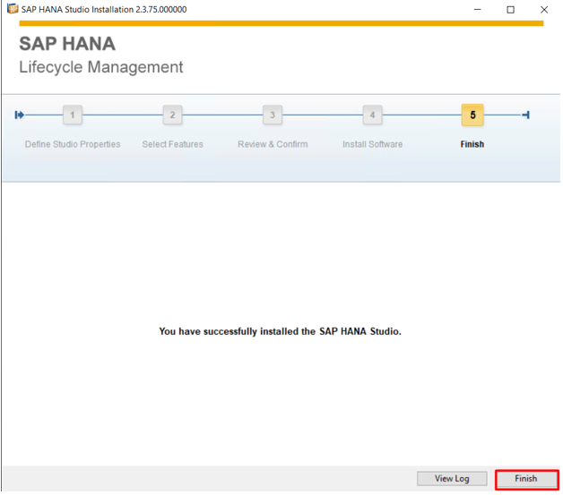

# HANA Database Installation for SAP Business One

I have installed the SAP HANA database to support SAP Business One, a popular ERP solution for small and medium-sized enterprises. The SAP HANA database provides high-performance data processing, enabling real-time analytics and transactional processing for SAP Business One.
The installation was carried out on a SUSE Linux environment, ensuring high availability, security, and scalability for the database, which is crucial for SAP Business One's smooth operation.

🔹 **Projects & Expertise**

✅ Successfully installed SAP HANA database on a SUSE Linux system to support SAP Business One.

✅ Configured the SAP HANA database for high-performance operations, ensuring fast query execution and real-time analytics.

✅ Integrated SAP HANA with SAP Business One for seamless ERP functionality.

✅ Set up backup and recovery strategies for HANA, ensuring business continuity.

✅ Optimized HANA database performance, implementing best practices for SAP workloads.

✅ Ensured database security by configuring roles, users, and permissions to safeguard sensitive business data.

